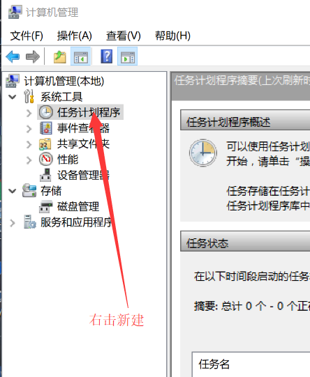
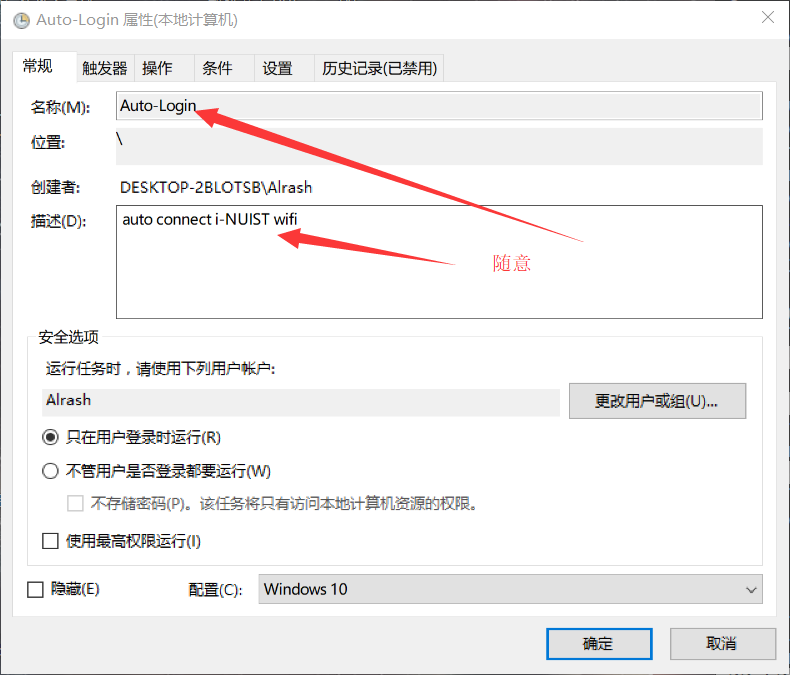
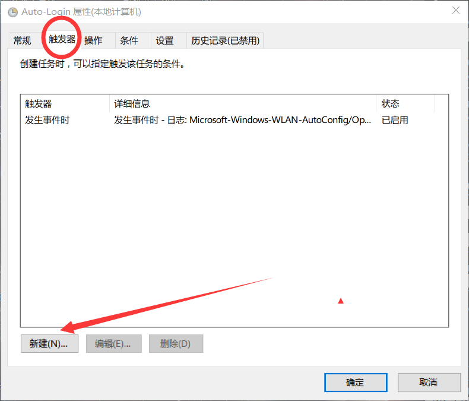
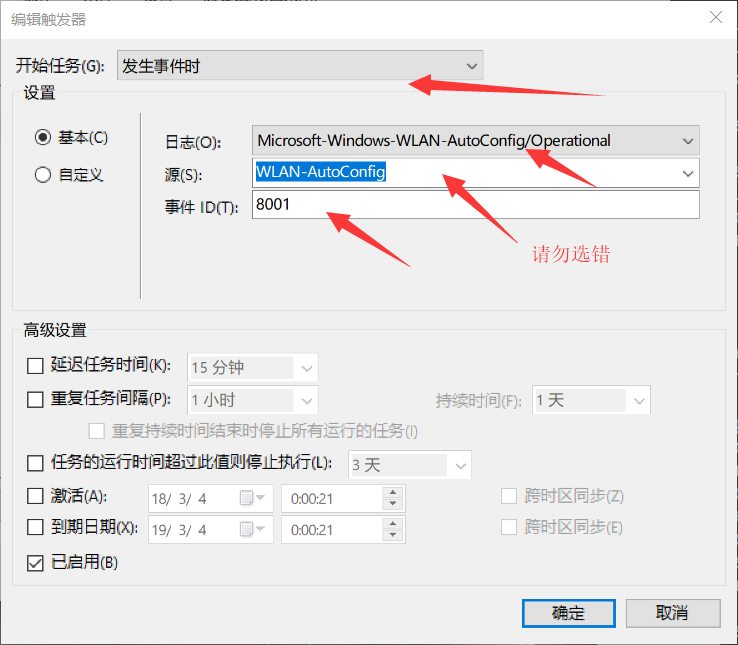
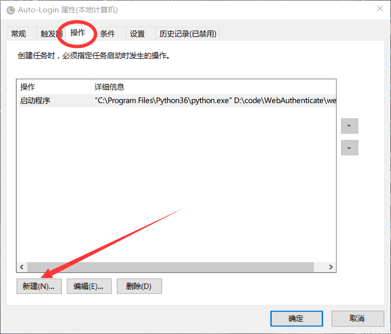
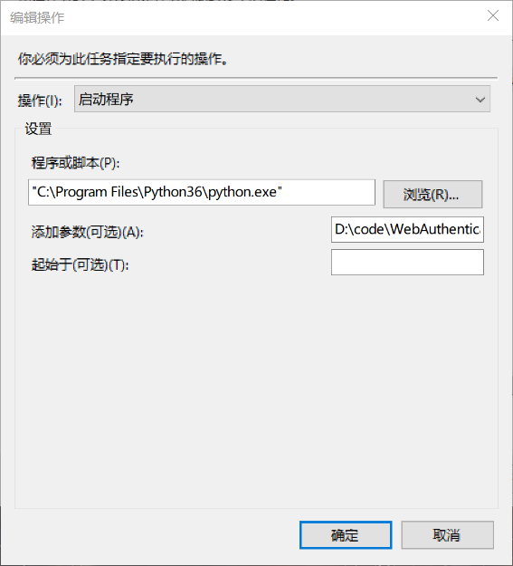
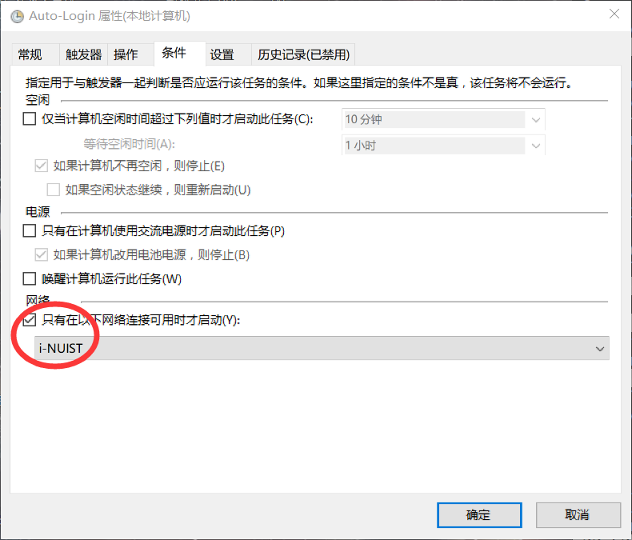
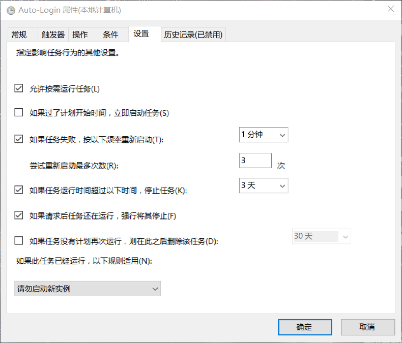

# 脚本版认证

## 用途
> 1. 用于南京信息工程大学校园网web认证：
> 2. 可用于windows与linux平台
> 3. 可通过部分设置，达到开机启动的效果

## 依赖
> 1. python3
> 2. pywifi模块

## 部分bug
> 1. windows无法强制切换wifi

## 如何使用
> 1. 使用-h参数查看参数使用
> 2. 常用参数
>  * -I 表示连接
>  * -c filename 表示使用filename配置文件，**不加此参数，默认为当前目录下的webAuthenticate.json**
>  * -s alias 表示使用配置文件中的哪一组配置
>  * -O 表示退出登陆

## 配置文件
配置文件使用json格式编写 
```json
[
    {
        "alias":"-s 参数指定的名称",
        "username": "登陆时的用户名",
        "provider": "供应商，具体请看自带的配置文件",
        "encrypt": "true or false",
        "password": "密码；与encrypt对应，true时，请填写base64编码之后的文本；false时，直接使用明文"
    }
]
```

## 登陆样例
```python
python webAuthenticate -I -s alrash -c "D:\code\WebAuthenticate\webAuthenticate.json"
```

## windows登陆设置
**右击“此电脑”/“我的计算机”等，选择“管理”**  









## 许可证
MIT

## 作者邮箱
**kasukuikawai@gmail.com**<br>
1607768311@qq.com
